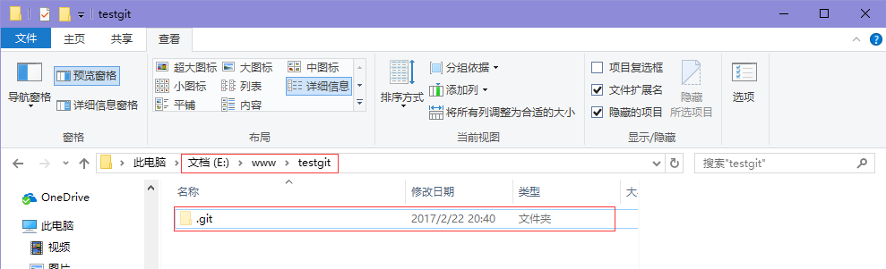

#Git操作指南
## Git使用基础
### 1. Git是什么
- Git是目前世界上最先进的分布式版本控制系统。
***

### 2. 在windows上安装git，完成基本配置
- 默认安装完成后，在开始菜单找到“Git->Git Bash”。
- 使用Git自带的Git Bash工具
- 打开Git Bash，因为Git是分布式版本控制系统，所以需要填写用户名和邮箱
```
注意：git config  –global 参数，有了这个参数，表示你这台机器上所有的Git仓库都会使用这个配置，当然你也可以对某个仓库指定的不同的用户名和邮箱。
```
- 查看配置信息

### 3.创建版本库
- 版本库又名仓库，可以简单理解为一个目录，在这个目录里的所有文件都会被Git管理起来，每个文件的修改、删除，Git都能跟踪，以便任何时刻都可追踪历史，或者在将来的某个时刻还可以将文件“还原”
- 创建一个版本库也十分简单，在D盘->www目录下新建一个testgit版本库

```
pwd命令用于显示当前的目录
```
	（1）通过命令`git init`把这个目录变成git可以管理的仓库
    
    
    （2）把文件添加到版本库中
    需要明确一下，所有的版本控制系统,只能跟踪文本文件的改动，比如txt、网页、所有程序的代码等，Git也不例外，版本控制系统可以告诉你文本文件的改动。
## 通过一个Demo熟悉版本库的增删查改
- 第一步：先在testgit目录下新建一个记事本文件，内容为1111111

- 第二步：使用`git add readme.txt`把文件添加到暂存区里面去。

- 第三步：使用`git commit`告诉Git，把文件提交到仓库

- 第四步：通过命令`git status`来查看是否还有未提交的文件（如果如下图示，则说明没有任何文件未提交）

- 第五步：修改readme.txt,在第二行添加22222222,使用`git status`再来查看文件的状态

- 第六步：查看文件修改的内容，通过`git diff readme.txt`来查看

 - readme.txt文件内容从一行11111111改成 二行 添加了一行22222222内容。
- 第七步：知道了对readme.txt文件做了什么修改后，就放心的提交到仓库了，提交修改和提交文件是一样的2步(第一步是git add  第二步是：git commit)。

- 第八步：对文件再添加一行333333333，并且提交到仓库

- 第九步：查看历史记录，通过`git log`命令

 - 使用`git log --pretty=oneline`简化为一行
 
- 第十步：回退上一个版本
想使用版本回退操作，我想把当前的版本回退到上一个版本，要使用什么命令呢？可以使用如下2种命令，第一种是：`git reset  -–hard HEAD^`那么如果要回退到上上个版本只需把`HEAD^`改成`HEAD^^`以此类推。那如果要回退到前100个版本的话，使用上面的方法肯定不方便，我们可以使用下面的简便命令操作：`git reset  –hard HEAD~100`

	- 再来查看一下readme.txt文件的内容
	
	- 可以继续使用git log 来查看下历史记录信息
	
- 第十一步：回到最新版本
想回退到最新的版本，如：有333333的内容，可以通过版本号回退(如果忘记版本号或者关闭过一次命令行工具，可以通过`git reflog`来看)

	- 通过上面的显示我们可以知道，增加内容3333的版本号是`b231791`我们现在可以命令
	

## 工作区与暂存区的区别
**工作区**：就是你在电脑上看到的目录，比如目录下testgit里的文件(.git隐藏目录版本库除外)。或者以后需要再新建的目录文件等等都属于工作区范畴。

**版本库(Repository)**：工作区有一个隐藏目录.git,这个不属于工作区，这是版本库。其中版本库里面存了很多东西，其中最重要的就是stage(暂存区)，还有Git为我们自动创建了第一个分支master,以及指向master的一个指针HEAD。

## 远程仓库
在了解之前，先注册github账号，由于你的本地Git仓库和github仓库之间的传输是通过SSH加密的，所以需要一点设置：
- 第一步：创建SSH Key。在用户主目录下，看看有没有.ssh目录，如果有，再看看这个目录下有没有id_rsa和id_rsa.pub这两个文件，如果有的话，直接跳过此如下命令，如果没有的话，打开命令行，输入如下命令：
`ssh-keygen  -t rsa –C “youremail@example.com”`, 由于我本地此前运行过一次，所以本地有，如下所示：

**id_rsa是私钥，不能泄露出去，id_rsa.pub是公钥，可以放心地告诉任何人。**
- 第二步：登录github,打开” settings”中的SSH Keys页面，然后点击“Add SSH Key”,填上任意title，在Key文本框里黏贴id_rsa.pub文件的内容。


###如何添加远程库？
现在的情景是：我们已经在本地创建了一个Git仓库后，又想在github创建一个Git仓库，并且希望这两个仓库进行远程同步，这样github的仓库可以作为备份，又可以其他人通过该仓库来协作。
- 首先，登录github上，然后找到“create a new repo”创建一个新的仓库。
- 目前，在GitHub上的这个testgit仓库还是空的，GitHub告诉我们，可以从这个仓库克隆出新的仓库，也可以把一个已有的本地仓库与之关联，然后，把本地仓库的内容推送到GitHub仓库。
- 现在，根据GitHub的提示，在本地的testgit仓库下运行命令：


把本地库的内容推送到远程，使用`git push`命令，实际上是把当前分支master推送到远程。
由于远程库是空的，我们第一次推送master分支时，加上了 –u参数，Git不但会把本地的master分支内容推送的远程新的master分支，还会把本地的master分支和远程的master分支关联起来，在以后的推送或者拉取时就可以简化命令。推送成功后，可以立刻在github页面中看到远程库的内容已经和本地一模一样了，上面的要输入github的用户名和密码如下所示：


从现在起，只要本地作了提交，就可以通过如下命令：

`git push origin master`

把本地master分支的最新修改推送到github上了，现在你就拥有了真正的分布式版本库了。
